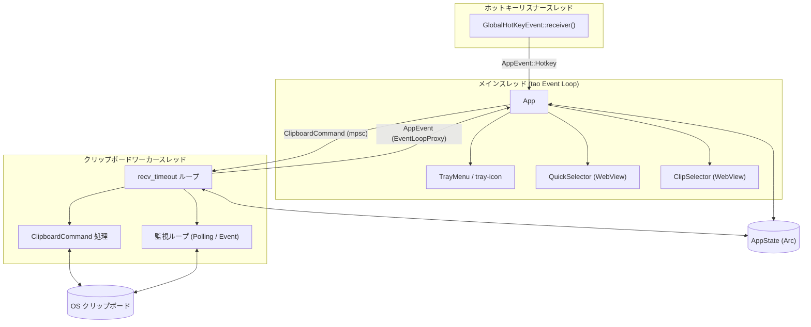

# ClipRefiner 開発者向けドキュメント

ユーザ向けの機能説明・操作方法は [README.md](README.md) を参照してください。設定の詳細は [CONFIG.md](CONFIG.md)、バージョンごとの変更内容は [CHANGELOG.md](CHANGELOG.md) を参照してください。

## 目次

- [前提条件](#前提条件)
- [ソースからのビルド](#ソースからのビルド)
- [プラットフォーム別パッケージ作成](#プラットフォーム別パッケージ作成)
- [開発・テスト](#開発テスト)
- [品質チェック](#品質チェック)
- [ライブラリとしての利用](#ライブラリとしての利用)
- [プロジェクト構成](#プロジェクト構成)
- [スレッドモデル](#スレッドモデル)
- [ログ](#ログ)
- [リリースと変更履歴](#リリースと変更履歴)
- [コーディング規約](#コーディング規約)

---

## 前提条件

- [Rust / Cargo](https://www.rust-lang.org/tools/install) (edition 2024、Rust 1.96 以上。`rust-toolchain.toml` でピン留め)

### Linux の追加パッケージ

GUI および通知機能のために、以下のパッケージが必要になる場合がある:

```bash
sudo apt-get install libdbus-1-dev pkg-config libatk1.0-dev libgtk-3-dev
```

画面 OCR を利用する場合は Tesseract 本体と日本語言語パックも必要:

```bash
sudo apt-get install tesseract-ocr tesseract-ocr-jpn tesseract-ocr-eng
```

Wayland 環境では `xcap` の画面キャプチャが未対応の compositor があり、その場合は OCR 開始時にエラー通知となる。

---

## ソースからのビルド

```bash
git clone <repository_url>
cd clip-refiner
cargo build --release
```

バイナリは `target/release/ClipRefiner` (Windows では `ClipRefiner.exe`) に生成される。各プラットフォーム用のビルドスクリプトも利用できる:

| プラットフォーム | スクリプト |
| :--------------- | :--------- |
| Windows          | `scripts/windows/build.ps1` |
| macOS            | `scripts/macos/build.sh` |
| Linux            | `scripts/linux/build.sh` |

---

## プラットフォーム別パッケージ作成

### Windows MSI

`cargo-wix` と WiX Toolset v3 を使って MSI を作成できる。

```powershell
# 前提: cargo install cargo-wix --locked
#       winget install WiXToolset.WiXToolset
./scripts/windows/build-msi.ps1
```

出力先: `target/wix/clip-refiner-{version}-{arch}.msi` (per-user インストール、日本語 UI)

### macOS DMG

`cargo-bundle` で `.app` バンドルを作成し、`hdiutil` で DMG インストーラーを生成する。macOS 11.0 以降が必要。

```bash
# 前提: cargo install cargo-bundle --locked
#       Xcode Command Line Tools
./scripts/macos/build-dmg.sh
```

出力先:

- `target/release/bundle/osx/ClipRefiner.app`
- `target/bundle/clip-refiner-{version}-{arch}.dmg` (Applications へのシンボリックリンク付き)

`--skip-build` (`-s`) を付けると、既存のリリースビルドからパッケージのみ作成する。

### Linux deb

`cargo-deb` で `.deb` パッケージを作成する。デスクトップエントリとアイコンも同梱される。

```bash
# 前提: cargo install cargo-deb --locked
#       上記「Linux の追加パッケージ」をインストール済みであること
./scripts/linux/build-deb.sh
```

出力先: `target/debian/clip-refiner_{version}-1_{arch}.deb`

インストール後は `ClipRefiner` コマンドとアプリケーションメニューから起動できる。ログイン時自動起動は XDG `autostart` を使用する。

`--skip-build` (`-s`) を付けると、既存のリリースビルドからパッケージのみ作成する。

---

## 開発・テスト

```bash
# 単体テスト・統合テストを実行
cargo test

# ライブラリ API のドキュメントを生成
cargo doc --no-deps --open
```

加工ロジックは `clip_refiner` ライブラリクレートとしても利用できる。

```rust
use clip_refiner::{RefineContext, RefineMode, Refiner};

let ctx = RefineContext::default();
let output = RefineMode::UrlDecode.refine("hello%20world", &ctx);
assert_eq!(output, "hello world");
```

統合テスト (`tests/`) では監視ループ・ワーカー・履歴・正規表現の主要経路を検証する。

| ファイル | 検証内容 |
| :------- | :------- |
| `monitor_flow.rs` | 監視加工、Undo、同一テキストの再加工抑制、自身の書き戻しスキップ |
| `worker_flow.rs` | 手動加工 (`ProcessMode`)、履歴復元後の再加工抑制 |
| `history_flow.rs` | 暗号化履歴の記録・重複処理・復号 |
| `regex_flow.rs` | `config` の正規表現設定、コンパイルキャッシュ、Event 方式 |

テスト用ヘルパー (`test_helpers`) はデバッグビルド、`cargo test` 実行時、または `test-helpers` feature 有効時に利用可能。

---

## 品質チェック

プラットフォーム別の `check` スクリプトで、整形・Clippy・テストを一括実行できる。

| プラットフォーム | スクリプト |
| :--------------- | :--------- |
| Windows          | `scripts/windows/check.ps1` |
| macOS            | `scripts/macos/check.sh` |
| Linux            | `scripts/linux/check.sh` |

個別コマンド:

```bash
cargo fmt --check
cargo clippy --all-targets --features test-helpers -- -D warnings
cargo test --all-targets --features test-helpers
cargo test --doc --features test-helpers
```

---

## ライブラリとしての利用

`Cargo.toml` に依存を追加し、`clip_refiner` クレートから加工 API を呼び出す。

```toml
[dependencies]
clip_refiner = { path = ".." }
```

公開 API の要約:

| 型 / 関数 | 説明 |
| :-------- | :--- |
| `RefineMode` | 加工モードの列挙型 |
| `RefineContext` | 加工時のコンテキスト (正規表現設定など) |
| `Refiner` | 加工のエントリポイント |
| `run()` | アプリケーション全体の起動 (バイナリと同等) |

詳細は `cargo doc --open` で生成される API ドキュメントを参照。

---

## プロジェクト構成

```
clip-refiner/
├── src/
│   ├── main.rs          # バイナリエントリポイント
│   ├── lib.rs           # ライブラリクレート・run()
│   ├── refiner/         # 加工モードと変換ロジック
│   ├── tray/            # システムトレイ・ホットキー・セレクター UI
│   ├── config/          # config.toml の読み書き・マイグレーション
│   ├── platform/        # OS 固有 (通知・OCR・クリップボード画像)
│   ├── security/        # 履歴暗号化・機密マスキング
│   └── ui/              # クイックセレクター / 登録クリップセレクターの HTML・CSS・JS
├── tests/               # 統合テスト
├── scripts/             # ビルド・品質チェック用スクリプト
├── packaging/           # Linux デスクトップエントリなど
├── CONFIG.md            # 設定リファレンス (config.toml)
└── wix/                 # Windows MSI 用 WiX ソース
```

セレクター UI (`src/ui/`) は WebView 上で動作し、`selector-common.js` に共通ロジックを集約している。

---

## スレッドモデル

監視モード (引数なし起動) では、クリップボード操作を単一スレッドに集約し、UI は `tao` のイベントループ上で動作する。各スレッドの役割と通信経路は次のとおり。



### 各コンポーネント

| コンポーネント | スレッド | 責務 |
| :------------- | :------- | :--- |
| **Event Loop** (`tray/runner.rs`) | メイン | ウィンドウイベント、トレイメニュー、WebView IPC、`AppEvent` の受信と `App::handle_event` への振り分け |
| **Hotkey Listener** (`tray/hotkey.rs`) | 専用 | `global-hotkey` のイベントをブロッキング受信し、`EventLoopProxy` 経由で `AppEvent::Hotkey` をメインスレッドへ送る |
| **Clipboard Worker** (`tray/worker/`) | 専用 | すべてのクリップボード読み書き、監視ループ、設定ファイルの外部変更ポーリング。`recv_timeout` でコマンド受信と監視チックを交互に処理 |
| **AppState** (`tray/state/`) | 共有 (`Arc`) | 設定 (`RwLock`)、加工済み状態・履歴・Undo 用テキスト (`Mutex`)。UI とワーカーの両方から参照 |

### 通信の要点

- **UI → ワーカー**: `ClipboardCommand` を `mpsc` チャネルで送信 (手動加工、履歴復元、登録クリップコピーなど)
- **ワーカー → UI**: `EventLoopProxy<AppEvent>` でユーザーイベントを送る (例: 設定再読み込み完了)
- **ホットキー → UI**: 専用スレッドが `AppEvent::Hotkey` を送り、メインスレッドの `HotkeyHandler` が処理
- **クリップボード**: `arboard::Clipboard` はワーカースレッド内の 1 インスタンスのみが触る (競合回避)

加工ロジック自体 (`refiner/`) はスレッドを持たず、ワーカーまたはワンショット実行 (`bootstrap.rs`) から同期的に呼ばれる。

---

## ログ

ログファイルは設定ディレクトリ内の `logs/` フォルダに日次ローテーションで保存される (保存場所は [CONFIG.md のログ節](CONFIG.md#ログ) を参照)。

ログレベルは環境変数 `RUST_LOG` で制御できる (例: `RUST_LOG=debug`)。

| ビルド種別 | 出力先 |
| :--------- | :----- |
| デバッグビルド (`cargo build` / `cargo run`) | ログファイル + 標準出力 |
| リリースビルド | ログファイルのみ |

---

## リリースと変更履歴

バージョンごとの利用者向け変更内容は [CHANGELOG.md](CHANGELOG.md) に記載する ([Keep a Changelog](https://keepachangelog.com/ja/1.1.0/) 形式)。

リリース作業の目安:

1. `Cargo.toml` の `version` を更新し、Git タグ `v{version}` を付与する
2. [CHANGELOG.md](CHANGELOG.md) の `[Unreleased]` 節を新バージョン見出し (`## [x.y.z] - YYYY-MM-DD`) へ移し、空の `[Unreleased]` を用意する
3. 設定スキーマ (`consts::CONFIG_VERSION`) を変更したリリースでは、CHANGELOG の **設定** 節に移行内容を書く
4. ユーザ向けの大きな変更があれば [README.md](README.md) / [CONFIG.md](CONFIG.md) も合わせて更新する

---

## コーディング規約

リポジトリ内の `.cursor/rules/` に、次の規約が定義されている。

| ファイル | 内容 |
| :------- | :--- |
| `imports.mdc` | `use` 文のグループ順・空行・アルファベット順 |
| `comments.mdc` | コメントの文体 (常体)、セクション区切り、`///` の書き方 |

Pull Request 前に [品質チェック](#品質チェック) を通すこと。
